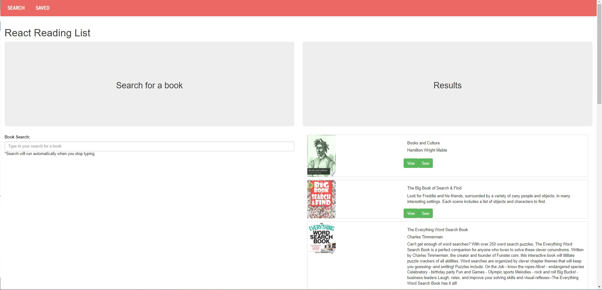
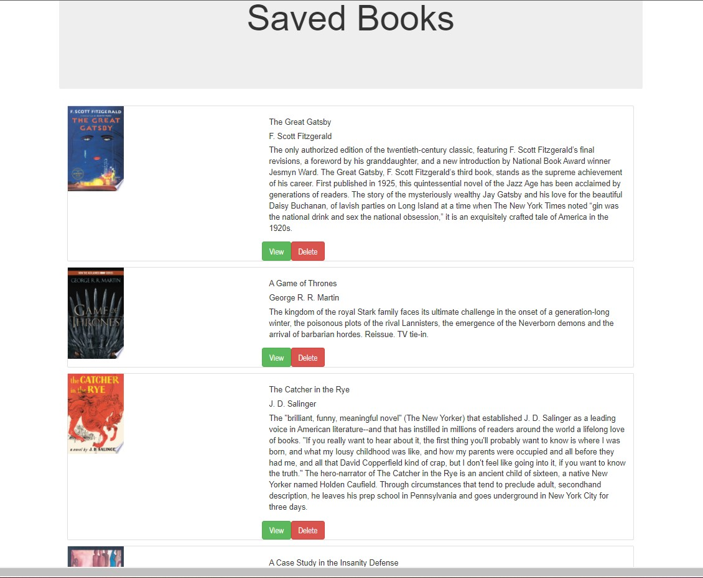

# React Google Books API Reading List

## Table of Contents:

1. [Description](#description)
2. [Installation](#Installation)
3. [Usage](#Usage)
4. [Contributing](#Contributing)
5. [Tests](#Tests)
6. [License](#License)
7. [GitHub](#GitHub)
8. [E-mail](#E-mail)

## Description

I built this React app to demonstrate the use of React Components, Hooks, and a Custom Hook. The app returns search results from the Google Books API. Users can save the results to a MongoDB backend to create a Reading List of book titles. Users can also delete books from the Reading List as well.

User Story:
AS An avid reader,
I WANT an app that helps me find new titles to read,
SO THAT I can save them to a Reading List.

Sceenshots

Deployed website:
[Here is a link to the deployed website](https://googlebooksapireadinglist.herokuapp.com/)

## Installation

The app is deployed to Heroku, so feel free to check out the site Online.

## Usage

Start at the Search page and type in an author or book title. The search bar utilizes debounce and the search fires automatically when you stop typing. Review your results from the Google Books API and save books that you want to add to your Reading List. To see your Reading List, click the Saved tab on the site's navbar.

## Contributing

Please open an issue to discuss any proposed contributions.

## Tests

Please update any tests as appropriate.

## License

## GitHub

https://github.com/EsmondKim

## E-mail

www.linkedin.com/in/esmondkim
